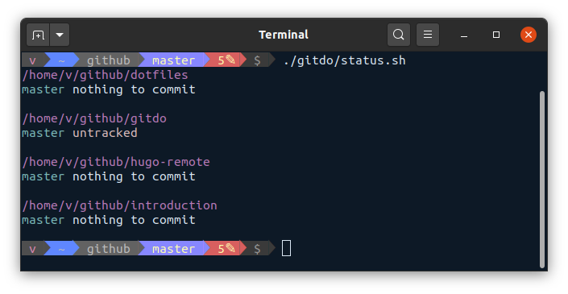

# Tools for doing things with Git 🦾

A collection of shell scripts that do helpful things with Git repositories.



## Included Tools

- `list-push-remotes.sh`: outputs to stdout the origin push URL for each Git repository. Use this to create a list of your Git remote URLs.
- `status.sh`: a variant of [`git-rundown`](https://github.com/victoriadrake/git-rundown). Use this to quickly see the status of all your Git repositories.

## Usage

`gitdo` scripts expect to live alongside your other Git repositories. This works well when you keep all your Git repositories under a single directory, e.g. `workspace/` or `github/`. For example:

```text
github/
├── dotfiles
├── gitdo
├── hugo-remote
└── introduction
```

When in the `github/` directory, you can run `gitdo` scripts in the terminal. For example:

```sh
cd github/
./gitdo/status.sh
```

This lists the current `git status` information for all your repositories.

## Contributions

Script contributions and improvements are most welcome!
